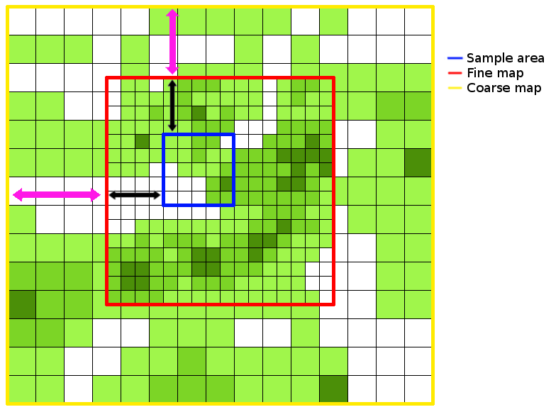

.. _`Introduction_pycoalescence`:
pycoalescence
=============

.. role:: pycode(code)
   :language: python


.. include:: builds.rst

Introduction
------------

**pycoalescence** is a Python module for the spatially explicit coalescence neutral simulator, necsim, described
:ref:`here <Introduction_necsim>`. **pycoalescence** provides a pythonic interface to the C++ simulator for swift
simulation set-up, initiation and analysis. It is intended to be used be ecologists studying neutral dynamics in
spatially explicit systems.

Features
--------

A large number of performance-enhancing features have been implemented, as well as support for a wide number of
scenarios. The features include:

- Coalescence methods written in C++ for excellent performance.
- Full output of community structure, with species IDs generated for every individual.
- Full spatial modelling, using a dispersal kernel to simulate spatial dynamics.
- Multiple sampling points, both spatially and temporally.
- Simulations of a region much larger than the sample area.
- Calculation of many biodiversity metrics, including species richness, species abundances, beta-diversity and
  locations of lineages.
- Usage of protracted speciation to restrict the time period that speciation events can occur in.
- Generate and apply a metacommunity to a simulation without requiring a new simulation to be performed.
- Scalability - support for simulations of tens or hundreds of millions of individuals in a single simulation.

Getting started
---------------
.. contents::
   :depth: 1
   :local:

Installation
~~~~~~~~~~~~

Two methods of installation are recommended: using conda to handle package management, including installation of all
dependencies, or using `pip <https://pypi.org/project/pip/>`__ into Python virtual environments
(see `here <http://docs.python-guide.org/en/latest/dev/virtualenvs/>`__ for good advice).

The other methods of installing listed here are provided as references to the install process itself, and to provide
finer control over installation methods if difficulties are encountered. Note that pip and conda both internally call
setuptools, which in turn runs ``installer.py``.

.. important:: Mac OS X and Linux are supported through pip. Mac OS, Linux and Windows are supported through conda.
               For manual installation it should be possible to install **pycoalescence** on any system, but may require
               some tinkering.

.. note:: See :ref:`here <installation_issues>` for solutions to some common installation issues.

.. note:: Whichever installation option you use, it is important to ensure that the package is compiled in the same
          environment as you intend to run simulations.

Installing via conda
''''''''''''''''''''

.. include:: conda_version.rst

`Conda <https://conda.io/docs/>`_ is a package manager that handles sourcing of all dependencies in a relatively
straight-forward, cross-platform manner. **pycoalescence** is provided on conda-forge, so please be aware of the
`conda forge gotchas <https://conda-forge.org/docs/conda-forge_gotchas.html>`_, especially regarding mixing the
``conda-forge`` and ``default`` channels. Installation of the package and all dependencies including boost, gdal, cmake
and the relevant C++ compiler, simply requires ``conda install -c conda-forge pycoalescence``, although we recommend
installing directly to a clean virtual environment using ``conda install --name MyEnv1 -c conda-forge pycoalescence``.
Note that conda installs the dependencies into its own environment and may ignore system installs.

conda on Linux
``````````````

C++14 compilers are currently unsupported on Linux on conda-forge, meaning that installation through this channel is not
possible at this time. The solution is to build the package recipe on your local machine using the following steps
(requires git and conda are installed locally).

- Change directory to a temporary directory and source the base conda environment

    - ``cd temp``
    - ``source /path/anaconda3/bin/activate``

- Download the recipe from conda-forge using git and modify the recipe to include linux

    - ``git clone https://github.com/conda-forge/pycoalescence-feedstock.git``
    - Delete "or linux" from line 18 in pycoalescence-feedstock/recipes/meta.yaml. This will allow the build on linux
      systems.


-  Build the package (make sure conda-build package has been installed) and install the package to your desired
   environment.

    - ``conda-build .`` (this step takes some time)
    - ``conda install --use-local pycoalescence --name MyEnv``

.. note:: When the C++ compilers are updated on conda-forge, this method for installing on Linux will no longer be
          necessary.


Installing via pip
''''''''''''''''''

.. include:: pypi_version.rst

.. note:: See :ref:`here <installation_issues>` for solutions to some common installation issues.

Installation via pip requires that the non-pythonic dependencies are installed manually first. Importantly, make sure
that `gdal <http://www.gdal.org/>`__ is fully functional. On some systems this appears to need compilation directly from
source. Also ensure that you have a C++14 compliant compiler, `cmake <https://cmake.org/>`_,
`sqlite <https://www.sqlite.org/download.html>`__ and `boost <http://www.boost.org>`__ installed. Finally make sure
your Python 3 is >= 3.6.1 or Python 2 >= 2.7.9.

With all requirements installed, it is recommended that you use a virtual environment (or pipenv) to control your
Python packages (`see here <http://docs.python-guide.org/en/latest/dev/virtualenvs/>`__).

Finally, installation of **pycoalescence**, including Python dependencies, should just require
``pip install pycoalescence``. The package should be downloaded and built.


Installing manually - setuptools
''''''''''''''''''''''''''''''''

This method is not recommended unless you experience problems with conda or pip. To install using setuptools, download
the source code manually and run ``python setup.py install`` from the terminal. Running this command will install
**pycoalescence** to the current Python environment.

Installing manually - installer.py
''''''''''''''''''''''''''''''''''

Calling ``python installer.py [opts]`` from the *pycoalescence* directory within the source code allows for finer
control over installation options. Importantly, two different make environments can be used, either ./configure and
make, or cmake. A list of options is given below, and can also be displayed by running ``python installer.py -h``.
Running ``python installer.py`` will generate the package in-place, meaning that it will not be added to the Python
environment. This can be desirable for HPC systems where package installation is not permitted.


+--------------------+-------------------------------------------------------------------------+---------+
| Option             | Description                                                             | Default |
+--------------------+-------------------------------------------------------------------------+---------+
| --cmake            | Build the C++ library (necsim) required for pycoalescence.              | True    |
+--------------------+-------------------------------------------------------------------------+---------+
| --autotools        | Use the autotools build process (./configure and make)                  | False   |
+--------------------+-------------------------------------------------------------------------+---------+
| --compiler-args    | Additional arguments to pass to the autotools compiler                  | None    |
+--------------------+-------------------------------------------------------------------------+---------+
| --cmake-args       | Additional arguments to pass to the cmake compiler during configuration | None    |
+--------------------+-------------------------------------------------------------------------+---------+
| --cmake-build-args | Additional arguments to pass to the cmake compiler at build time        | None    |
+--------------------+-------------------------------------------------------------------------+---------+
| --debug            | Compile using DEBUG defines                                             | False   |
+--------------------+-------------------------------------------------------------------------+---------+
| -c -C --compile    | Compile only, do not re-configure necsim                                | False   |
+--------------------+-------------------------------------------------------------------------+---------+

HPC installation
''''''''''''''''

On systems where package installation is not possible, use ``python installer.py`` to build the package in-place.
Alternatively, ``python hpc_setup.py`` provides a custom installation with a few options switched on for HPC systems,
including usage of the intel compiler by default and optimisation flags for HPC. Note that this option uses the
autotools process (``./configure`` and ``make``) instead of cmake for compilation.

.. _`installation_issues`:

Installation issues
'''''''''''''''''''

Consider using `conda <https://conda.io/docs/>`_ to manage package dependencies if you experience issues and please
report any problems you have. On Mac OS X, installation via pip requires that the dependencies have already been
provided.

Gdal issues
```````````

First, make sure the gdal C++ library has been installed on your system. On macOS run ``brew install gdal`` and for
linux distributions run ``apt-get install gdal-devel`` or equivalent.

The most common issue for installing **pycoalescence** is gdal dependencies not being found (including errors relating
to cpl_error.h, gdal.h, gdal_priv.h or cpl_conv.h). This is usually the result of gdal installing in a non-standard
location, or the header files not being included with the gdal install. One option to test that gdal is installed
properly on your system is to run ``from osgeo.gdal_array import _gdal_array`` from a python interpreter. If this gives
an error, one possible fix on Unix systems is to uninstall the gdal python package and reinstall using
``pip install gdal==$(gdal-config --version) --global-option=build_ext --global-option=$(gdal-config --cflags)`` to make
sure that the gdal links to your system's version.

If this still doesn't fix your problems, try compiling the C++ library on your system from source first. Then download
the Python package from `here <https://pypi.org/project/GDAL/#files>`_ that matches your local C++ version, and run
``python setup.py build`` from the gdal directory. If this is successful, run ``python setup.py install`` to install
gdal to your Python environment.

.. note:: The development versions of boost, sqlite3 and gdal are required, which looks something like ``gdal-devel``
          for Linux distributions.

.. note:: Install scipy and matplotlib to remove warnings when importing **pycoalescence**
          (``pip install scipy matplotlib``).

Boost issues
````````````

If you are on macOS, use brew install

For issues related to missing boost headers, make sure that your system has boost properly installed through your
package manager. Development versions of boost are required on linux. Ensure that the paths to the boost headers are
visible to **pycoalescence**.

.. note:: boost 1.68.0 is currently unsupported on conda due to changes in compiler link options.

.. _`performing_simulations`:

Performing simulations
~~~~~~~~~~~~~~~~~~~~~~

Check out the full simulation examples in `this jupyter notebook <src/examples.ipynb>`_.

Setting up simulations
''''''''''''''''''''''

The process of setting up a :class:`Simulation <pycoalescence.simulation.Simulation>` object is outlined below.

#. Instantiate our :class:`Simulation <pycoalescence.simulation.Simulation>` object using
   :pycode:`sim = Simulation(logging_level=20)` where the logging level corresponds to the amount of information that is
   displayed using `Python's logging module <https://docs.python.org/3/library/logging.html>`_ (20 corresponds to
   "info", the second highest display level, after "debug").

#. Specify simulation parameters

   - Use :func:`set_simulation_parameters() <pycoalescence.simulation.Simulation.set_simulation_parameters>`
     to set the job number, task number, output directory and other key simulation variables.
   - Set the map variables by one of the following:

     a. :func:`set_map_parameters() <pycoalescence.landscape.Landscape.set_map_parameters>` to input file paths and dimensions
     b. :func:`set_map_files() <pycoalescence.simulation.Simulation.set_map_files>` to set the map file paths. This
        calls :func:`detect_map_dimensions() <pycoalescence.simulation.Simulation.detect_map_dimensions>` to automatically
        detect file offsets and dimensions.

     .. tip:: Check `Limitations of simulation variables`_ for important information on restrictions on simulation
        inputs.

     .. note:: :func:`detect_map_dimensions() <pycoalescence.simulation.Simulation.detect_map_dimensions>` requires
        that the files are in **.tif** formats so that file dimensions can be read. If input files are csv format,
        method a) should be used.

     .. note:: One can specify either "null" or "none" map types; "null" creates a map at the specified
               size, whereas "none" creates hard boundaries without any in-memory map object created at all. However,
               the dimensions of these files must be manually supplied.

   - Optionally, also run :func:`set_speciation_rates() <pycoalescence.simulation.Simulation.set_speciation_rates>`
     to set a list of speciation rates to apply at the end of the simulation.

#. Run the simulation
   This is split into 3 parts, which can be called individually if necessary:

    #. Finalise setup

        - Run :func:`finalise_setup() <pycoalescence.simulation.Simulation.finalise_setup>` to check that simulations
          are setup and set up the maps and data structures in memory :ref:`necsim <Introduction_necsim>`.

    #. Run simulations

        - Start the simulation using :func:`run_coalescence() <pycoalescence.simulation.Simulation.run_coalescence>`
        - Returns True if the simulations complete successfully and False if the simulations run out of time and pause

    #. Apply speciation rates and output database

        - Generate a coalescence tree for each speciation rate using
          :func:`apply_speciation_rates() <pycoalescence.simulation.Simulation.apply_speciation_rates`
        - This function also writes the output to the simulation file.

.. important:: The last three steps can be combined using :func:`run() <pycoalescence.simulation.Simulation.run>`,
               which also performs checks for if the simulation has run out of time and paused, rather than completing.

See the :ref:`examples <sim_examples>` for the full simulation process.

.. note::
    See Glossary_ for definitions of :term:`sample map`, :term:`fine map` and :term:`coarse map`.

Key Features
''''''''''''

Some key simulation features are:

- **Set differing landscape types** using fine and coarse density maps, both current and historical (see
  :func:`set_map_files() <pycoalescence.simulation.Simulation.set_map_files>` and
  :func:`add_historical_map() <pycoalescence.landscape.Landscape.add_historical_map>`).
- **Specify a sampling mask**, as a binary sampling mask defining areas to sample from (the sample map). Alternatively,
  for varying sampling effort across space choose `uses_spatial_sampling=True` in
  :func:`set_simulation_parameters() <pycoalescence.simulation.Simulation.set_simulation_parameters>`.
- **Multiple sampling points in time** using
  :func:`add_sample_time() <pycoalescence.simulation.Simulation.add_sample_time>`.
- **Protracted speciation simulations** using `protracted=True` in
  :func:`set_simulation_parameters() <pycoalescence.simulation.Simulation.set_simulation_parameters>`.
- **Non-spatial simulations** using `spatial=False` in
  :func:`set_simulation_parameters() <pycoalescence.simulation.Simulation.set_simulation_parameters>`.
- **Spatial simulations using a variety of dispersal kernels**. This is the default, using a normally-distributed
  dispersal kernel. For other kernels see :ref:`here <disp_kernels>`.
- **Varying reproductive rates across space** using a map of relative reproductive rates. See :ref:`here <rep_map>`.
- **Varying death rates across space** using a map of relative death rates. See :ref:`here <rep_map>`.
- **Varying landscape types** including infinite landscapes, infinitely tiled landscapes of the coarse or fine density
  map and closed landscapes with hard boundaries. See :ref:`here <inf_land>`.


.. _sim_examples:
Examples
''''''''
Some basic examples are given below. For more complicated scenarios, including examples of fetching data from completed
simulations, please see `this jupyter notebook <src/examples.ipynb>`_.

A simple simulation

.. code-block:: python

    from pycoalescence import Simulation
    # set logging level to "info" (from logging module)
    c = Simulation(logging_level=20)
    # set the main simulation parameters - use default values for other keyword arguments
    c.set_simulation_parameters(seed=1, job_type=1, output_directory="output", min_speciation_rate=0.1,
                                sigma=4, deme=10, sample_size=0.1, max_time=1)
    # optionally add a set of speciation rates to apply at the end of the simulation
    c.set_speciation_rates([0.1, 0.2, 0.3])
    # set the map parameters - null means the map will be generated with 100% cover everywhere (no file input).
    c.set_map_parameters(sample_file = "null", sample_x = 100, sample_y=100,
                         fine_file = "null", fine_x = 200, fine_y = 200, fine_x_offset = 50, fine_y_offset = 50,
                         coarse_file = "null", coarse_x = 1000, coarse_y = 1000,
                         coarse_x_offset = 100, coarse_y_offset = 100, coarse_scale = 10,
                         historical_fine_map = "null", historical_coarse_map = "null")
    # run checks, complete the simulation and output the database
    c.run()

A more complex example using multiple temporal sampling points and detection of map dimensions from the
inputted map files.

.. code-block:: python

    from pycoalescence import Simulation
    c = Simulation()
    # set the main simulation parameters
    c.set_simulation_parameters(seed=1, job_type=1, output_directory="output", min_speciation_rate=0.1,
                                sigma=4, tau=4, deme=1, sample_size=0.1
                                max_time=100, dispersal_method="fat-tailed", m_prob=0.0, cutoff=0,
                                dispersal_relative_cost=1, min_num_species=1, habitat_change_rate=0.2,
                                gen_since_historical=200, time_config_file="null", restrict_self=False,
                                landscape_type=False)
    # add a set of speciation rates to be applied at the end of the simulation
    c.set_speciation_rates([0.2, 0.3, 0.4])
    # set the map files - note that dimensions and offsets are detected automatically from the files
    c.set_map_files(sample_file="null", fine_file="path/to/fine.tif", coarse_file="path/to/coarse.tif")
    # add sample times
    c.add_sample_time(0.0)
    c.add_sample_time(1.0)
    # add historical maps
    c.add_historical_map(fine_map="path/to/historicalfine1.tif", coarse_map="path/to/historicalcoarse1.tif", time=1,
     rate=0.5)
    # run checks, complete the simulation and output the database
    c.run()

.. note:: necsim can also be run directly using command line arguments (see
          :ref:`Introduction to necsim <Introduction_necsim>`), but this is not recommended.


.. _`disp_kernels`:
Dispersal Kernels
'''''''''''''''''

Three different dispersal functions are currently supported, which take some combination of the *sigma* (:math:`\sigma`)
, *tau* (:math:`\tau` ), *m_prob* (:math:`m` ) and *cutoff* (:math:`c` ) dispersal parameters. You only need to provide
the required parameters for each dispersal method; any additional parameters provided will be ignored.

- Normal distribution (the default)
    This requires :math:`\sigma` only (the standard deviation). The outputted dispersal kernel in two dimensions
    will follow a Rayleigh distribution for dispersal distance, :math:`N(r)`

- Fat-tailed distribution
    This requires both :math:`\sigma` and :math:`\tau`. Importantly, for our fat-tailed dispersal kernel, :math:`F(r)`,
    :math:`\lim{\tau \to \inf} = N(r)`. Within this dispersal kernel, there is an increased chance of long-distance
    dispersal (but lower than the normal-uniform dispersal kernel).

- Normal-uniform distribution
    This requires :math:`\sigma`, :math:`m` and :math:`c` . Here, we pick with probability :math:`1-m` from a normal
    distribution with standard deviation :math:`\sigma`, and probability :math:`m` from a uniform distribution. This
    uniform distribution picks a random distance uniformly between 0 and :math:`c`, the maximal dispersal distance. For
    very large :math:`c`, extremely long distance dispersal is possible.

It is also possible to provide a dispersal probability map, which sets the probability of dispersing from one cell to
another. The dispersal map should be dimensions *xy* by *xy* where *x* and *y* are the dimensions of the fine map. A
dispersal map can be set by using
:func:`set_map_files(dispersal_map="/path/to/dispersal.tif") <pycoalescence.simulation.Simulation.set_map_files>`.

**pycoalescence** has the ability to simulate a dispersal kernel on a landscape. For more information about that
process, see :ref:`here <simulate_landscapes>`.

.. important:: In this scenario, it is not possible to use a coarse map, which should be "none".

.. _`rep_map`:
Differing demographic rates
'''''''''''''''''''''''''''

Simulations can use varying reproductive and/or death rates across the landscape, by using
:func:`set_map_files(reproduction_map="/path/to/rep.tif", death_map="/path/to/death.tif") <pycoalescence.simulation.Simulation.set_map_files>`.
In this scenario, all species have different per-capita reproduction and death rates across the landscape.

.. note:: Density is already taken into account during simulations for reproduction rates, so the reproduction map
          should be solely for the *per-capita* differences in reproductive rate.

.. note:: In a neutral model, each death event is followed by a birth event. The death map therefore represents both the
          relative number of deaths, and the relative number of maturations in each cell. The reproduction map instead
          indicates the relative number of propagules generated by each cell which may end up dispersing and maturing at
          other locations.

.. important:: The reproduction and death maps can only be used with a fine map, and coarse map should be set to "none".


Limitations of simulation variables
'''''''''''''''''''''''''''''''''''

.. important:: This section contains key information about the simulation inputs. Please read carefully to minimise any
               unnecessary bugs.

Certain simulation variables have limitations, depending on the method of setting up the simulation.

- Map variables set up using :func:`set_map_parameters() <pycoalescence.landscape.Landscape.set_map_parameters>`

    - Sample map dimensions must be smaller than fine map dimensions.
    - Fine map dimensions must be smaller than coarse map dimensions (supplied at the resolution of the fine map files).
    - Dimensions of historical fine and coarse maps must match their respective current map dimensions.
    - All offsets must maintain the smaller map within the larger map
    - If any files are supplied as 'null', map sizes must still be provided. This is important for sample map size, but
      should be corrected in a future update for coarse map files.


- Map files (and variables) set using :func:`set_map_files() <pycoalescence.simulation.Simulation.set_map_files>`

    - In addition to the above conditions being true, the files must all be georeferenced, so that coarse and fine map
      dimensions will be read correctly.

    .. hint:: Use a GIS program (such as ArcGIS or QGIS) for manipulation of map files to
              ensure georeferencing is preserved.

    - If the samplemask map is "null", the program will read the dimensions from the fine map and choose that as the
      area to sample entirely over. Supplying "null" will therefore sample the entirety of the fine map.

    .. hint:: Scalings and offsets between maps should also work correctly, but if problems are encountered, try manually
              specifying offsets and dimensions to identify any problems.

    - The reproduction map, death map and dispersal map (if provided) must match the dimensions of the fine map. No
      coarse map should be provided in these scenarios.

An example of how the map files are related is shown below. Black arrows indicate the offsets for the fine map (in the x
and y dimensions) and purple arrows indicate the offsets for the coarse map.



.. _`inf_land`:
Infinite Landscapes
'''''''''''''''''''

Simulations can also be run on infinite landscapes. Set ``landscape_types=opt`` in
:func:`set_simulation_parameters() <pycoalescence.simulation.Simulation.set_simulation_parameters>` where *opt* is one
of the following:

- "closed" (default)
    Run without infinite landscapes, with closed boundaries to the coarse map.

- "infinite"
    Run with a historical infinite landscape outside of the coarse map boundaries.

- "tiled_coarse"
    Tile the coarse map infinitely in all dimensions. A coarse map must be provided.

- "tiled_fine"
    Tile the fine map infinitely in all dimensions. No coarse map should be provided.

Optimising Simulations
''''''''''''''''''''''

.. note:: As of version 1.2.6rc35 dynamic resizing of internal objects is implemented. Whilst this does reduce RAM usage
          in all scenarios, it also means the optimisation process outlined below only relevant when the major
          constraint is the size of the density maps.

The optimisation process below can reduce RAM usage in systems where the major limitation is that the size of the
density maps is much larger than the number of individuals being simulated. This process has a minor to major impact on
performance, depending on the number of individuals. It will not fix issues with simulations not finishing, only reduce
the RAM requirements.

:func:`optimise_ram() <pycoalescence.simulation.Simulation.optimise_ram>` exists for reducing the RAM requirements of
a simulation. Running the function with a specific RAM limit, in GB, should choose a sample map size and offsets to
minimise the in-memory object sizes. This may have a minor impact on simulation speed, but this is likely negligible.
After the function is run, the :class:`Simulation class <pycoalescence.simulation.Simulation>` should have re-defined
the grid x and y dimensions to be the largest size possible to simulate for the required memory. The sample map offsets
from the grid are then also stored, such that the grid encompasses the area with the highest number of individuals.

:func:`optimise_ram() <pycoalescence.simulation.Simulation.optimise_ram>` may take some time to run. However, for a
single set of simulations with the same RAM limit, this function should only need to be completed once. Getting and
setting the optimised solution is therefore possible with
:func:`get_optimised_solution() <pycoalescence.simulation.Simulation.get_optimised_solution>` and
:func:`set_optimised_solution() <pycoalescence.simulation.Simulation.set_optimised_solution>`. The whole procedure is
outlined below.

.. code-block:: python

    # Detect the RAM-optimised solution
    >> sim1.optimise_ram()
    # Get the optimised solution for Simulation object sim1
    >> sim1.get_optimised_solution()
    {'grid_file_name': 'set',
    'grid_x_size': 5134,
    'grid_y_size': 5134,
    'sample_x_offset': 8208,
    'sample_y_offset': 14877}
    # Now set the optimised solution for Simulation object sim2
    >> sim2.set_optimised_solution({'grid_file_name': 'set',
                                  'grid_x_size': 5134,
                                  'grid_y_size': 5134,
                                  'sample_x_offset': 8208,
                                  'sample_y_offset': 14877})

Generating Configuration Files
''''''''''''''''''''''''''''''

The default process is to not generate any actual config files - these are instead kept in memory to be passed to C++.
However, the configs can be written to a file using
:func:`write_config() <pycoalescence.simulation.Simulation.write_config>`, which may be useful for storing simulation
parameters outside of the simulation database.

Example configuration file

::

    [main]
    seed = 1
    job_type = 2
    output_directory = output/
    min_spec_rate = 1e-05
    sigma = 0.5
    tau = 2
    deme = 10
    sample_size = 0.1
    max_time = 2000
    dispersal_relative_cost = 1
    min_species = 1

    [sample_grid]
    path = /Data/Maps/maskmap.tif
    x = 486
    y = 517
    mask = /Data/Maps/maskmap.tif

    [fine_map]
    path = /Data/Maps/finemap.tif
    x = 34000
    y = 28000
    x_off = 17155
    y_off = 11178

    [coarse_map]
    path = /Data/Maps/coarsemap.tif
    x = 24000
    y = 20000
    x_off = 10320
    y_off = 7200
    scale = 10.0

    [historical_fine0]
    path = none
    number = 0
    time = 200
    rate = 0

    [historical_coarse0]
    path = none
    number = 0
    time = 200
    rate = 0

    [historical_fine1]
    path = none
    number = 1
    time = 200
    rate = 0

    [historical_coarse1]
    path = none
    number = 1
    time = 200
    rate = 0

    [dispersal]
    method = norm-uniform
    m_probability = 1e-10
    cutoff = 0
    restrict_self = 0
    landscape_type = 0

.. _`Postsim_analysis`:
Post-simulation analysis
~~~~~~~~~~~~~~~~~~~~~~~~

Once simulations are complete, necsim's :ref:`applying speciation rates functionality <Introduction_SpeciationCounter>`
can be used to apply additional speciation rates to the coalescence tree. A simple way of applying additional simulation
rates is provided within the :class:`CoalescenceTree class<pycoalescence.coalescence_tree.CoalescenceTree>`.


The two functions for this routine are

-  :func:`set_speciation_parameters() <pycoalescence.coalescence_tree.CoalescenceTree.set_speciation_parameters>` which
   primarily takes a list of speciation rates to apply with other options for generating the community.

-  :func:`apply() <pycoalescence.coalescence_tree.CoalescenceTree.apply>` performs the analysis and writes to the output
   file. This can be extremely RAM and time-intensive for simulations of a large number of individuals. The calculations
   will be stored in extra tables within the same SQL file as originally specified.

Instead of speciation events always contributing a new species, they can instead draw from a metacommunity, simulating
immigration events. There are three methods of providing a metacommunity:

- simulate a non-spatial community using a metacommunity size and metacommunity speciation rate parameter to generate
  the species abundances from which to draw individuals.

- analytically generate the community using an approximation of the above simulation. The same two parameters
  (metacommunity size and metacommunity speciation rate) are required.

- Supply a database containing a SPECIES_ABUNDANCES table and an external community reference number referring to a
  particular generated community within the database.

All methods use the same function,
:func:`set_speciation_parameters() <pycoalescence.coalescence_tree.CoalescenceTree.set_speciation_parameters>` with
``option`` set as one of "simulated", "analytical" or a path to the external database, respectively for the above
three methods.


Examples
''''''''

A basic application procedure is

.. code-block:: python

    from pycoalescence import CoalescenceTree
    t = CoalescenceTree()
    speciation_rates = [0.1, 0.2 ,0.3]
    t.set_database("output/data_1_1.db")
    t.set_speciation_parameters(speciation_rates)
    t.apply()

The :class:`CoalescenceTree class<pycoalescence.coalescence_tree.CoalescenceTree>` object can also be set up from a
:class:`Simulation class<pycoalescence.simulation.Simulation>` object as:

.. code-block:: python

    from pycoalescence import Simulation, CoalescenceTree
    sim = Simulation()
    # ... set up simulation here, then run
    # Now import our completed simulation without needing to run t.set_database("filepath")
    t = CoalescenceTree(sim)

Example application with more complicated parameters

.. code-block:: python

    from pycoalescence import Simulation, CoalescenceTree
    sim = Simulation()
    # ... set up simulation here, then run
    # Now import our completed simulation without needing to run t.set_database("filepath")
    speciation_rates = [0.1, 0.2, 0.3]
    times = [0.0, 1.0, 2.0]
    t = CoalescenceTree(sim)
    t.set_speciation_parameters(speciation_rates=speciation_rates, record_spatial=True,
    record_fragments="path/to/fragments.csv", sample_file="path/to/sample/file.tif",
    times=times)
    t.apply()

.. note:: The record_fragments variable can either be boolean (to automatically detect contiguous fragments from the
          data), or a path to a csv file. The csv file should contain the fragment name, x min, y min, x max, y max and
          area (a weighting parameter usually equal to the number of variables). The x and y minima and maxima define
          the extremes of the fragment.

A few biodiversity metrics can then be obtained directly from the database using built-in functions, relieving the user
of having to generate these manually. These include

- species richness, using :func:`get_species_richness() <pycoalescence.coalescence_tree.CoalescenceTree.get_species_richness>`

- species abundances, using :func:`get_species_abundances() <pycoalescence.coalescence_tree.CoalescenceTree.get_species_abundances>`

- species octave (2^n) classes for generating species abundance distributions,
  using :func:`get_octaves() <pycoalescence.coalescence_tree.CoalescenceTree.get_octaves>`

Check out other full examples in `this jupyter notebook <src/examples.ipynb>`_.

.. note:: The above functions for acquiring biodiversity metrics require supplying a speciation rate and time,
          otherwise will output data for all speciation rates and times.

.. tip:: Equivalent functions also exist for obtaining individual fragment biodiversity metrics.

.. tip:: The entire coalescence tree can be outputted using
         :func:`get_species_list <pycoalescence.coalescence_tree.CoalescenceTree.get_species_list>`. This may be useful
         for scenarios where it is desirable to calculate custom biodiversity metrics.

Extended analysis
~~~~~~~~~~~~~~~~~

The :py:mod:`coalescence_tree <pycoalescence.coalescence_tree>` module can be used for more extensive simulation
analysis, such as comparing simulated landscapes to real data and calculating goodness of fits.

The general procedure for using this module involves a few functions, all contained in the
:class:`CoalescenceTree class <pycoalescence.coalescence_tree.CoalescenceTree>`.

- :func:`set_database() <pycoalescence.coalescence_tree.CoalescenceTree.set_database>` generates the link to the SQL
  database, which should be an output from a **necsim** simulation (run using the
  :class:`Simulation class <pycoalescence.simulation.Simulation>`).

- :func:`import_comparison_data() <pycoalescence.coalescence_tree.CoalescenceTree.import_comparison_data>` reads an
  SQL database which contains real data to compare to the simulation output. The comparison data should contain the
  following tables:

  - BIODIVERSITY\_ METRICS, containing *only* "metric", "fragment", "value" and "number_of_individuals" columns.
    The metric can be "fragment_richness" or any other metric created by your own functions which exists also in
    the simulated data.
  - SPECIES\_ABUNDANCES containing *at least* "SpeciesID", "Abund".

Additionally, one can provide the following if comparisons between fragments are required:

  - FRAGMENT\_ABUNDANCES containing *at least* "Plot", "Mnemonic" and "Abund".
  - FRAGMENT\_OCTAVES containing *at least* "fragment", "octave", "num_species". This can also be calculated from
    FRAGMENT\_ABUNDANCES using :func:`calculate_comparison_octaves() <pycoalescence.coalescence_tree.CoalescenceTree.calculate_comparison_octaves>`


Additional Package Features
~~~~~~~~~~~~~~~~~~~~~~~~~~~

These features are not required for spatially explicit coalescence models, as they are utilised internally by the
package. However, there are some features that could be of great convenience to users, especially for generating and
manipulating landscapes using tif files.

- Read tif files and perform a number of operations taking into account georeferencing of the data.
  Functionality is contained within the :class:`Map class <pycoalescence.map.Map>` (see :ref:`here <map_reading>`).
- Generate fragmented landscapes (see :ref:`here <generate_landscapes>`). This may be useful for generating example
  landscapes of a particular size with desired characteristics.
- Simulate a dispersal kernel on a landscape to obtain characteristics of the effective dispersal kernel. Currently only
  a single map is supported with "closed", "infinite" or "tiled" landscape types (see :ref:`here <simulate_landscapes>`).
- Simulations can be merged into a single output, with each simulation occupying a separate guild (see
  :ref:`here <merging_simulations>`). Analyses can then be performed on the combined data.


Testing install
~~~~~~~~~~~~~~~

The system install can be tested by running :py:mod:`test_install.py <pycoalescence.test_install>` from the command line
(``python test_install.py``) which requires that ``python setup.py`` has been successfully run previously or the package
otherwise successfully installed.

Prerequisites
-------------

Essential
~~~~~~~~~

Note that conda should detect and install all prerequisites automatically. Pip will detect and install Python
prerequisites (such as numpy), although on some systems will fail to install gdal.

-  Python version 2 >= 2.7.9 or 3 >= 3.6.1. Other versions may work, but are not supported.
-  C++ compiler (such as GNU g++) with C++14 support.
-  `Cmake <https://cmake.org/>`_ >= 3.6 for installing via pip or conda.
-  `The SQLite library <https://www.sqlite.org/download.html>`__ for both C++ and Python
   installations. Comes as standard with Python.
-  The gdal library for both Python and C++ (`available here <http://www.gdal.org/>`__). It allows reading parameter
   information from .tif files (using
   :func:`detect_map_dimensions() <pycoalescence.simulation.Simulation.detect_map_dimensions>`). Both the Python package
   and C++ binaries are required; installation differs between systems, so view the gdal documentation for more
   help installing gdal properly.
-  The Boost library for C++ available `here <http://www.boost.org>`__.
-  Numerical Python (``numpy``) package (``pip install numpy``).

Recommended
~~~~~~~~~~~

- Scipy package for generating fragmented landscapes (``pip install scipy``).

- Matplotlib package for plotting fragmented landscapes (``pip install matplotlib``).

Optional
~~~~~~~~


- For work involving large csv files, the fast-cpp-csv-parser by Ben Strasser, available
  `here <https://github.com/ben-strasser/fast-cpp-csv-parser>`__ can be used. This provides much faster csv read and
  write capabilities and is probably essential for larger-scale simulations, but not necessary if your simulations are
  small or you are intending to use *.tif* files (the recommended method). The folder
  *fast-cpp-csv-parser/* should be in the same directory as your **necsim** C++ header files (the lib/necsim directory)
  and requires manual installation.

.. note:: fast-cpp-csv-parser is no longer tested with updated versions of that package, but should still be functional.


.. include:: Glossary.rst

Version
-------

Version |release|

Contacts
--------

Author: Samuel Thompson

Contact: samuel.thompson14@imperial.ac.uk - thompsonsed@gmail.com

Institution: Imperial College London and National University of Singapore

This project is released under MIT See file
**LICENSE.txt** or go to
`here <https://opensource.org/licenses/MIT>`__ for full license
details.

